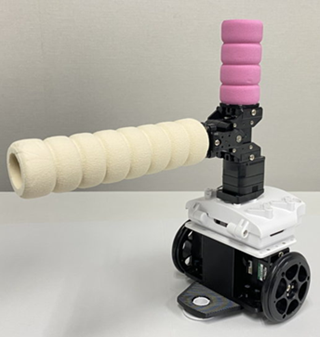
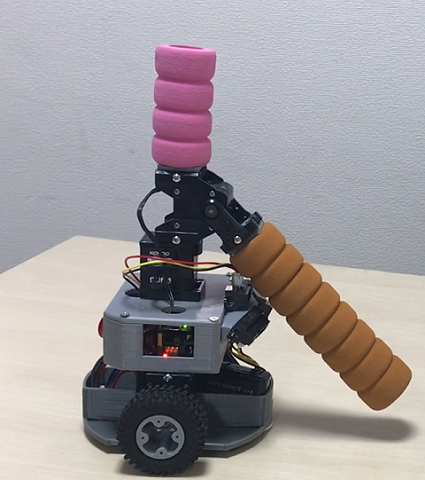

# ROBO-ONE Beginners競技規則
- 2025年12月27日作成
一般社団法人二足歩行ロボット協会

- 2025年10月17日 Google notebookLMによる競技規則の音声解説を追加しました。
[第4回ROBO-ONE_Beginnersの競技規則徹底解説](第4回ROBO-ONE_Beginnersの競技規則徹底解説.m4a) をダウンロードして競技規則を見ながら聞いて下さい。

## 参加要領

##.級段位認定制度
本大会に参加することにより、級段位の認定を行います。以下をご参照ください。

[https://github.com/nishibra/ROBO-ONE_Beginners/blob/main/shodan.md](https://github.com/nishibra/ROBO-ONE_Beginners/blob/main/shodan.md)

__昇級昇段の規定を満足した場合、各自より認定申請を行ってください。__
__ただし、本大会において同じ級で2度優勝したロボットは申請の有無にかかわらず昇級し、その後は新しい級での出場となります。__

### 2.ロボットの規定
- a).ロボットは、移動するための下半身と、胴体、頭部、腕を有する形状とする。移動方法は車輪型とする。
- b).ロボットは当協会が指定したロボットのみ参加できる。
- c).ロボットは操縦型、自律型のいずれでも良い。
   
指定ロボット(操縦型) [KXR-R2B/K ローバー型B/K 取説](https://kondo-robot.com/faq/kxr-r2b-k_manual_sample)

指定ロボット(自律型) [ロボットの作り方](https://github.com/nishibra/ROBO-ONE_Beginners_auto)

ロボットのサーボモーターは __KRS-3301およびKRS-3302のみを使用することができます。__ またバッテリーや構造は変更できませんが、センサー、電子回路、ソフトウェアは自由に変更できるものとします。

指定ロボット(Vision型)

準備中(__2025年度の大会後に展開予定__)
