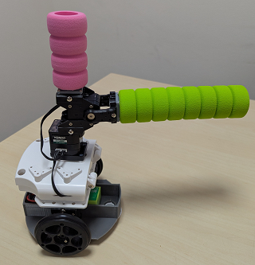

# 第1回ROBO-ONE Beginner競技規則 
(7月12日-13日開催検討中)   
(2025年4月7日作成).....一般社団法人二足歩行ロボット協会
 
## 参加要領
### 1.参加要領
- 1.競技規則の公開
大会の およそ3月前にホームページにて公開します。
- 2.参加申込み
大会のおよそ1か月以上前よりホームページにて開始します。
- 3.規格審査
大会当日実施し、試合開始までに終了します。
- 4.大会
予選は実施せず、決勝トーナメントによる試合とします。

### 2.参加資格
__中学生以下、または本大会3回以下の参加者。__

### 3.参加登録
以下のサイトより選手登録を行ったうえで、参加申し込みをお願いします。

ホームページ　　http://www.robo-one.com/

## ROBO-ONE beginner 競技規則
### 1.前文
ROBO-ONE大会に参加を目指す初心者の皆さんが簡単に楽しく参加できるビギナー向け格闘競技の開催を通して、ROBO-ONEの底辺を拡大し、ロボット教育の推進と知能を持つロボットの普及を目指す。

### 2.ロボットの規定
- a).ロボットは、移動するための下半身と、胴体、頭部、腕を有する形状とする。移動方法は車輪型とする。
- b).ロボットは当協会が指定したロボットのみ参加できる。
- c).ロボットは操縦型、自律型のいずれでも良い。
   
__指定ロボット(操縦型)__

__指定ロボット(自律型)__

__指定ロボット(Vision型)__

準備中

### 4.試合会場の規定
ROBO-ONE小リング上にて実施する。
リングのサイズは図に示す。表面の状態は±1mm以下の段差とし、材質は特に規定しない。
リング上部2m、リングの周囲30cm、周囲30cmのリングまでの高さは30cmまでは物を配置しない。ただし審判はこの範囲も自由に動けるものする。

   　　　　　 

ROBO-ONE小リング

リングを横から見た図

### 5.試合
#### 5.1.試合方法
- a).試合は持ち時間2分とし、礼に始まり、礼に終わる。
- b).レフリーの「はじめ」 の合図で 試合を開始する。
- c).「待て」の合図で試合を中断する。なお、ロボットが絡み合った場合、審判は脱力を指示する。この時はただちにロボットを脱力すること。
- d).「止め」の合図で試合を終了する。
- e).試合中において、「はじめ」、「待て」、「止め」の合図があった時、および審判の特別な指示がある場合以外は、ロボットを操作してはならない。

#### 5.2.決め技
- a).決め技は相手を倒すかまたは頭部への有効な攻撃とする。
- b).頭の上部をアームで有効に叩くことで1本とする。側部をたたくと有効とする。有効2回で1本とする。
- c).相手をアームで倒すことで1本とする。

#### 5.3.勝敗
- a).2分間3本勝負とし、3本先取で勝利とする。
- b).2分間終了で決め技数、反則数、有効数で勝敗を決める。
- b).2分間で決着がつかない場合は1分間の延長戦を行う。延長戦でも決着がつかない場合は、判定により勝敗を決する。

#### 5.4.反則
- a).反則2回で相手に1本を与える。
- b).体当たりや押し出しなどは反則となり、接触した方を反則1回とする。
- c).ロボットが壊れた場合やフェアプレーに反する行為があった場合などは、反則1回とする。
- d).タイムは1試合において1回取ることができる。タイムは1回1分とし、1回取得する度に反則1回とする。
- e).ロボットが動かなくなった場合、戦意なしと見なし、反則1回とする。
- f).試合開始までの準備時間は1分以内とし、1分経過毎に反則1回とする。
- g).アーム以外による攻撃は禁止する。アームを使わず相手に激突した場合は、激突した側の反則1回とする。
- h).自らリングから転落した場合は反則1回とする。

