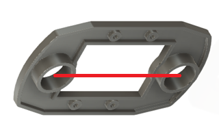

## ROBO-ONE級段位認定制度とは
この制度は、ロボット技術向上を促進し、より多くの人にROBO-ONEに親しんでもらうとともに、より多くのロボット技術者が育ち、ROBO-ONEがさらに盛り上がることを目指しています。
そしてその結果としての段位がROBO-ONEの技術レベルを世の中の方々に知って頂くことができれば良いと考えています。
__1級まではROBO-ONE Beginnersに参加して認定を受けてください。初段以上の認定については詳細は今後明確にしていきます。__

### 昇級・昇段の条件
BOBO-ONE Beginnersにおいて技術の異なるロボットを使用して以下の2つの条件を両方満たすと、級や段が上がります。

- タイムトライアル：小リングを外周に沿って1分以内に1周できること。これは3回まで挑戦できます。概ね外周エッジより50cmの範囲を走行してください。
- 対戦勝利数：同じクラスで5回以上勝つこと。対戦相手の級や段は関係ありません。これまでの勝利数は持ち越せます。負け数は考慮されません。

### 昇級・昇段表
各級・段位には、ロボットの仕様や搭載技術に関する認定基準が設けられています。操縦型ロボットでは1級までとし、その後は自律型に移行して頂きます。級については飛び級が可能ですが、段位に関しては順に認定を得る必要があります。

| 級段 | 3級 | 2級 | 1級 | 初段 | 2段 | 3段 | 4段 | 5段 | 6段 |
| ---- | --- | --- | --- | --- | --- | --- | --- | --- | --- |
| 車輪 | 2輪 | 2輪 | 2輪 | 2輪 | 2輪 | - | - | - | - |
| 全後長 | 90mm | 70mm | 50mm | - | - | - | - | - | - |
| 脚数 | - | - | - | - | 2脚 | 4脚 | 2脚 | 2脚 | 2脚 |
| 腕色 | 黄白 | 茶 | 緑 | - | - | - | - | - | - |

- *1)車輪：搭載できる車輪の数です。
- *2)全後長：ロボットの前後で設置するキャスター中心間距離です。下図赤線の長さです。変更にはstlフォルダーにstl-ファイルを準備しましたので3D-printerから出力してご利用ください。

  
- *3)脚数：ロボットの脚の数です。
- *4)__腕色:アームのスポンジの色です。それぞれのクラスの認定中は指定の色のアームをつけてください。__

4段以上では足のサイズを小さくすることで難易度upを検討しています。

