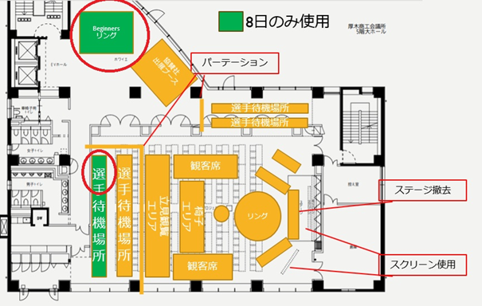

# 第5回ROBO-ONE Beginners参加者ガイド

## ＜参加者ガイドについて＞
このガイドでは、当イベントの参加手順をご紹介したガイダンスです。運営上必要な内容を含めていますので、必ずよくお読みになってご参加ください。また、このガイドは参加証と一緒に印刷して会場に持参していただきますようご協力をお願いします。

## ＜会場入場＞
### 受付
- 日時 2026年3月8日（日）
- 場所 厚木商工会議所
10：00より試合会場への入場が可能です。選手待機場所にてロボットの準備をお願いします。準備ができればリングを使った練習が可能です。
試合会場は5階です。下図の緑のエリアです。選手待機場所で使用できるのは4テーブルのみです。

### レギュレーションチェック
- 10:30よりレギュレーションチェックを行います。
番号シールを貼ってレギュレーションチェックを終了となります。

- 1)バッテリーチェック
今回は、危険防止のためレギュレーションチェック時にバッテリーチェックを行います。確認する項目は下記の通りです。
--　本体に異常がいないか　
・本体のフィルムにショートするほどの亀裂がないか　
・ケーブルの被膜のはがれや亀裂が入っていないか　
・コネクタが外れかけていないか　
その他事故につながる危険性があるバッテリーは使用できません。

- 2)段位認定クラス確認
レギュレーションチェック時に認定クラスを確認します。

級/段位認定については以下をご確認ください。今大会は1級までの認定を行います。飛び級ありです。キャスター間の長さとアームスポンジの色が異なります。寸法と色を確認してください。アームスポンジは参加者にてご準備ください。

https://github.com/nishibra/ROBO-ONE_Beginners/blob/main/shodan.md

また、同じ級で2度優勝したロボットは申請の有無にかかわらず昇級し、その後は新しい級での出場となります。

- 3)出場順番号シール貼り

出場順に番号シールを貼ります。前回のシールなどははがしてください。番号シールは事務局にて準備します。

### <開催スケジュール>
- 08日(日)
10:30 選手受付/レギュレーションチェック(準備ができたロボットから順次チェックを進めてください。) 

11:00 オープニング

11:10 リング周回タイムトライアル

小リングを外周に沿って1分以内に1周できること。これは3回まで挑戦できます。概ね外周エッジより50cmの範囲を走行してください。自律型は操縦できません。

12:00 操縦体験

(カプセルキャッチャー:2台で実施します。ロボットはリングを周回します。レフリーの合図で、リング中央に置いたカプセルを1分以内に自分のコーナーに運ぶことでおもちゃ入りカプセルをゲットできます。たくさん運べた場合は好きなものが選べます。自律型も操縦可能です。)

一般観戦者により体験操縦を行いますが、Beginners参加者も参加できます。

12:30 休憩

13:30 決勝トーナメント

14:20 操縦体験

(ロボットバトル:ロボットによるバトルを行います。相手を倒せば1ポイント。めんは無しです。2ポイント取った方が勝ちです。自分で倒れてもダウンです。自立型も操縦可能です。)

一般観戦者により体験操縦を行いますが、Beginners参加者も参加できます。

14:50 表彰式

15:00 終了

