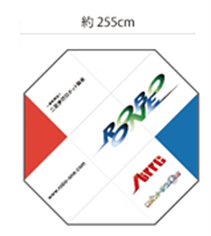

# 第5回ROBO-ONE Beginners競技規則
開催日:2026年3月8日
場所:厚木市商工会議所　5F

- 2025年12月27日作成
一般社団法人二足歩行ロボット協会

## 参加要領
### 1.参加要領
- 1.競技規則の公開
大会の およそ2月前にホームページにて公開します。
- 2.参加申込み
大会のおよそ1か月以上前よりホームページにて開始します。
- 3.規格審査
大会当日実施し、試合開始までに終了します。
- 4.大会
予選と決勝トーナメントによる試合とします。

(注)ROBO-ONE Beginnersはロボワンビギナーズと読みます。

### 2.参加資格
どなたでも参加できます。ただし高校生二年生以上は自律型のみへ参加とします。

### 3.参加登録
以下のサイトより選手登録を行ったうえで、参加申し込みをお願いします。

ホームページ　　http://www.robo-one.com/

### 4.級段位認定制度
本大会に参加することにより、級段位の認定を行います。以下をご参照ください。

[https://github.com/nishibra/ROBO-ONE_Beginners/blob/main/shodan.md](https://github.com/nishibra/ROBO-ONE_Beginners/blob/main/shodan.md)

昇級昇段の規定を満足した場合、各自より認定申請を行ってください。
ただし、本大会において同じ級で2度優勝したロボットは申請の有無にかかわらず昇級し、その後は新しい級での出場となります。

## ROBO-ONE beginners 競技規則
### 1.前文
ROBO-ONE大会に参加を目指す初心者の皆さんが簡単に楽しく参加できるビギナー向け格闘競技の開催を通して、ROBO-ONEの底辺を拡大し、ロボット教育の推進と知能を持つロボットの普及を目指す。

### 2.ロボットの規定
- a).ロボットは、移動するための下半身と、胴体、頭部、腕を有する形状とする。移動方法は車輪型とする。
- b).ロボットは当協会が指定したロボットのみ参加できる。
- c).ロボットは操縦型、自律型のいずれでも良い。
   
指定ロボット(操縦型) [KXR-R2B/K ローバー型B/K 取説](https://kondo-robot.com/faq/kxr-r2b-k_manual_sample)

指定ロボット(自律型) [ロボットの作り方](https://github.com/nishibra/ROBO-ONE_Beginners_auto)

ロボットのサーボモーターはKRS-3301およびKRS-3302のみを使用することができます。またバッテリーや構造は変更できませんが、センサー、電子回路、ソフトウェアは自由に変更できるものとします。

指定ロボット(Vision型)

準備中(2025年度の大会後に展開予定)

### 4.試合会場の規定
ROBO-ONE小リング上にて実施する。
リングのサイズは図に示す。表面の状態は±1mm以下の段差とし、材質は特に規定しない。
だたし参加者が多い場合は0.9m×0.9mまたは1.8m×1.8mの四角リングを使用する場合がある。
リング上部2m、リングの周囲30cm、周囲30cmのリングまでの高さは30cmまでは物を配置しない。ただし審判はこの範囲も自由に動けるものする。

   　　　　　 

ROBO-ONE小リング

リングを横から見た図

### 5.試合
#### 5.0.予選
予選はタイムトライアルにより行います。
タイムトライアルは小リングを外周に沿って1周するタイムを争います。これは3回まで挑戦でき、ベストタイムを記録とします。概ね外周エッジより50cmの範囲を走行してください。__今回より障害物(第28回ROBO-ONE Lightで使用するパイロン)を配置します。__
参加者が多い場合は上位32台が予選を通過し決勝トーナメントに出場できます。__少ない場合は敗者トーナメント(一回戦敗退者によるトーナメント)を実施します。__

#### 5.1.決勝トーナメントの試合方法
- a).試合は持ち時間2分とし、礼に始まり、礼に終わる。
- b).レフリーの「はじめ」 の合図で 試合を開始する。
- c).「待て」の合図で試合を中断する。なお、ロボットが絡み合った場合、審判は脱力を指示する。この時はただちにロボットを脱力、または電源スイッチを切ること。
- d).「止め」の合図で試合を終了する。
- e).試合中において、「はじめ」、「待て」、「止め」の合図があった時、および審判の特別な指示がある場合以外は、ロボットを操作してはならない。
- f). 頭部のスポンジの色はピンク(赤コーナ)または紫(青コーナ)とする。アームのスポンジの色はピンクまたは紫以外とする。
- g). 3Dプリントパーツを含め、スポンジ以外の箇所では黒、グレー、白などの無彩色とする。

#### 5.2.決め技
- a).決め技は相手を倒すかまたは頭部への有効な攻撃とする。
- b).頭の上部をアームで有効に叩くことで2点とする。"めん 2ポイント"とコールする。
- c).頭の側部をたたくと1点とする。"よこめん 1ポイント"とコールする。
- d).連続した頭部への決め技は1度のみ有効な攻撃とする。
- e).相手をアームで倒すことで3点とする。アーム以外がリングに付いた時"押し倒し 3ポイント"とコールする。
- f).有効な攻撃であった場合でも、自身が転倒した場合はその攻撃を無効とし、レフリーが指示する位置から試合を再開する。
- g).__押し倒しから自力で5カウント(約5秒)以内に起き上がることができればマイナス2ポイントとします。したがって起き上がることができれば"押し倒し1ポイント"となります。__

#### 5.3.勝敗
- a).2分間5点勝負とし、5点を先に取った方が勝利とする。
- b).2分間終了の場合は点数で勝敗を決める。
- c).2分間で決着がつかない場合は1分間の延長戦を行う。延長戦でも決着がつかない場合は、判定により勝敗を決する。

#### 5.4.反則
- a).反則1回で相手に1点を与える。
- b).アーム以外による攻撃は禁止する。故意の体当たりや押し出しをした場合は反則1回とする。
- c).フェアプレーに反する行為があった場合は、反則1回とする。
- d).タイムは1試合において1回取ることができる。タイムは1回2分とし、反則2回とする。
- e).ロボットが動かなくなったり壊れた__ 場合は、戦意なしと見なし、反則1回とし、修理の時間を1分間設け、試合を再開する。戦えない場合は相手の勝利とする。
- f).試合開始までの準備時間は1分以内とし、1分経過毎に反則1回とする。
- g).自らリングから転落した場合は反則1回とする。
- h).お互いに攻撃をしない場合、それぞれを反則１回として、レフリーが指示する位置から試合を再開する。
  
#### 5.5 異議申し立て
- a).異議申し立ては、選手からのみ受け付ける。
- b).選手は手をあげ大きな声で”異議あり”と審査員に申し出ること。
- c).異議申し立ては、1チーム1試合につき1件までとする。ただし異義が認められた場合はさらに1件の異議申し立てができる。
